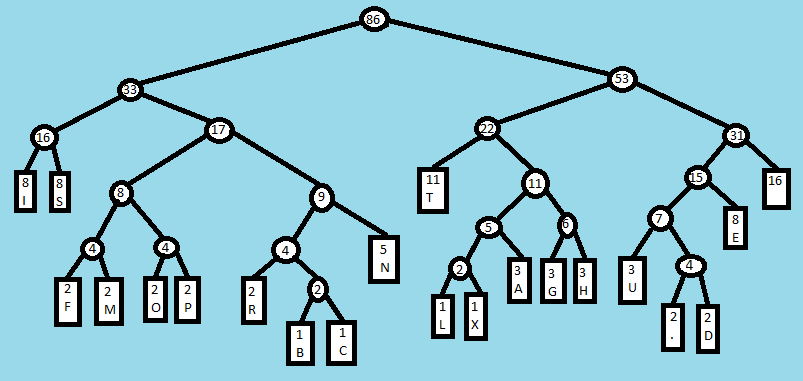

# Algorithm
## Overview
### Binary Trees
Huffman trees are also [binary trees](https://en.wikipedia.org/wiki/Binary_tree); that is, they are a data structure which is made up of nodes.  Each node has up to two child nodes, and a tree consists of a single _root_ node.  Nodes that have one or more children are called _internal_ nodes, and nodes with no children are called _leaf_ nodes.

Huffman trees are a subset of _binary_ trees, where:
* `leaf` nodes always have 0 child nodes, and have an associated `symbol` (usually a byte or character)
* `internal` nodes always have 2 child nodes, and never have an associated `symbol`
* `leaf` and `internal` nodes always have a `frequency` value
    * leaf node frequencies record the number of times a symbol appears in a data stream
    * internal node frequencies are the sum of the frequencies of the two child nodes

### Building The Tree
To build a Huffman tree for a given input data stream:
1. determine the frequency of each byte that appears in the input data stream
1. for each byte, create a `[symbol:frequency]` pair and add to a list
1. until the list only has a single element remaining:
    1. sort the list of `[symbol:frequency]` pairs
        1. in the simple case, sort by frequencies
        1. if frequencies equal, sort by symbols, if both are available
        1. otherwise, sort by the number of elements in each tree; this should allow larger trees to bubble up to the end of the list
    1. remove the first two elements from the list, and merge them
        1. their parent node is an internal node; these have a frequency which is the sum of both child nodes
        1. the two removed elements become the two child nodes
    1. add the new internal node back into the list
    1. repeat

### Encoding
A "lookup" encoding map can be generated by recursively traversing the tree.  Each time the left node is used, the associated bit is `0`, and for right the associated bit is `1`.  When a leaf node is reached, the collected bits represent a code that can be substituted for the associated character.

Simply substituting the character (in the input) for the associated code (in the output) results in an encoded message.

### Decoding
The huffman algorithm guarantees that there is no ambiguity in decoding values - that is, for a given code, no other generated code is a prefix of that code.

As such, decoding can be completed by pulling bits from the incoming (encoded message) stream until a leaf/symbol node is reached.  When a `0` is encountered, use the left node; when a `1` is encountered, use the right node.

## Example
This is a trivial example, using the input String
```
this is a sample input string. its text is being used to test the huffman coding tree.
```

We're using a text string here instead of binary data to make the steps easier to follow.

### Tree Building
The expandos below show the elements in the list as the tree is being assembled.

<details>
<summary>initial list</summary>
<pre>
<code>
frequencies list has [21] elements
[1] <= [b]
[1] <= [c]
[1] <= [l]
[1] <= [x]
[2] <= [.]
[2] <= [d]
[2] <= [f]
[2] <= [m]
[2] <= [o]
[2] <= [p]
[2] <= [r]
[3] <= [a]
[3] <= [g]
[3] <= [h]
[3] <= [u]
[5] <= [n]
[8] <= [e]
[8] <= [i]
[8] <= [s]
[11] <= [t]
[16] <= [ ]
</code>
</pre>
</details>

<details>
<summary>iteration 1</summary>
<pre>
<code>
frequencies list has [20] elements
[1] <= [l]
[1] <= [x]
[2] <= [.]
[2] <= [d]
[2] <= [f]
[2] <= [m]
[2] <= [o]
[2] <= [p]
[2] <= [r]
[2] <= INTERNAL[1|b, 1|c]
[3] <= [a]
[3] <= [g]
[3] <= [h]
[3] <= [u]
[5] <= [n]
[8] <= [e]
[8] <= [i]
[8] <= [s]
[11] <= [t]
[16] <= [ ]
</code>
</pre>
</details>

<details>
<summary>iteration 2</summary>
<pre>
<code>
frequencies list has [19] elements
[2] <= [.]
[2] <= [d]
[2] <= [f]
[2] <= [m]
[2] <= [o]
[2] <= [p]
[2] <= [r]
[2] <= INTERNAL[1|b, 1|c]
[2] <= INTERNAL[1|l, 1|x]
[3] <= [a]
[3] <= [g]
[3] <= [h]
[3] <= [u]
[5] <= [n]
[8] <= [e]
[8] <= [i]
[8] <= [s]
[11] <= [t]
[16] <= [ ]
</code>
</pre>
</details>

<details>
<summary>iteration 3</summary>
<pre>
<code>
frequencies list has [18] elements
[2] <= [f]
[2] <= [m]
[2] <= [o]
[2] <= [p]
[2] <= [r]
[2] <= INTERNAL[1|b, 1|c]
[2] <= INTERNAL[1|l, 1|x]
[3] <= [a]
[3] <= [g]
[3] <= [h]
[3] <= [u]
[4] <= INTERNAL[2|., 2|d]
[5] <= [n]
[8] <= [e]
[8] <= [i]
[8] <= [s]
[11] <= [t]
[16] <= [ ]
</code>
</pre>
</details>

<details>
<summary>iteration 4</summary>
<pre>
<code>
frequencies list has [17] elements
[2] <= [o]
[2] <= [p]
[2] <= [r]
[2] <= INTERNAL[1|b, 1|c]
[2] <= INTERNAL[1|l, 1|x]
[3] <= [a]
[3] <= [g]
[3] <= [h]
[3] <= [u]
[4] <= INTERNAL[2|., 2|d]
[4] <= INTERNAL[2|f, 2|m]
[5] <= [n]
[8] <= [e]
[8] <= [i]
[8] <= [s]
[11] <= [t]
[16] <= [ ]
</code>
</pre>
</details>

<details>
<summary>iteration 5</summary>
<pre>
<code>
frequencies list has [16] elements
[2] <= [r]
[2] <= INTERNAL[1|b, 1|c]
[2] <= INTERNAL[1|l, 1|x]
[3] <= [a]
[3] <= [g]
[3] <= [h]
[3] <= [u]
[4] <= INTERNAL[2|., 2|d]
[4] <= INTERNAL[2|f, 2|m]
[4] <= INTERNAL[2|o, 2|p]
[5] <= [n]
[8] <= [e]
[8] <= [i]
[8] <= [s]
[11] <= [t]
[16] <= [ ]
</code>
</pre>
</details>

<details>
<summary>iteration 6</summary>
<pre>
<code>
frequencies list has [15] elements
[2] <= INTERNAL[1|l, 1|x]
[3] <= [a]
[3] <= [g]
[3] <= [h]
[3] <= [u]
[4] <= INTERNAL[2|., 2|d]
[4] <= INTERNAL[2|f, 2|m]
[4] <= INTERNAL[2|o, 2|p]
[4] <= INTERNAL[2|r, 1|b, 1|c]
[5] <= [n]
[8] <= [e]
[8] <= [i]
[8] <= [s]
[11] <= [t]
[16] <= [ ]
</code>
</pre>
</details>

<details>
<summary>iteration 7</summary>
<pre>
<code>
frequencies list has [14] elements
[3] <= [g]
[3] <= [h]
[3] <= [u]
[4] <= INTERNAL[2|., 2|d]
[4] <= INTERNAL[2|f, 2|m]
[4] <= INTERNAL[2|o, 2|p]
[4] <= INTERNAL[2|r, 1|b, 1|c]
[5] <= [n]
[5] <= INTERNAL[1|l, 1|x, 3|a]
[8] <= [e]
[8] <= [i]
[8] <= [s]
[11] <= [t]
[16] <= [ ]
</code>
</pre>
</details>

<details>
<summary>iteration 8</summary>
<pre>
<code>
frequencies list has [13] elements
[3] <= [u]
[4] <= INTERNAL[2|., 2|d]
[4] <= INTERNAL[2|f, 2|m]
[4] <= INTERNAL[2|o, 2|p]
[4] <= INTERNAL[2|r, 1|b, 1|c]
[5] <= [n]
[5] <= INTERNAL[1|l, 1|x, 3|a]
[6] <= INTERNAL[3|g, 3|h]
[8] <= [e]
[8] <= [i]
[8] <= [s]
[11] <= [t]
[16] <= [ ]
</code>
</pre>
</details>

<details>
<summary>iteration 9</summary>
<pre>
<code>
frequencies list has [12] elements
[4] <= INTERNAL[2|f, 2|m]
[4] <= INTERNAL[2|o, 2|p]
[4] <= INTERNAL[2|r, 1|b, 1|c]
[5] <= [n]
[5] <= INTERNAL[1|l, 1|x, 3|a]
[6] <= INTERNAL[3|g, 3|h]
[7] <= INTERNAL[3|u, 2|., 2|d]
[8] <= [e]
[8] <= [i]
[8] <= [s]
[11] <= [t]
[16] <= [ ]
</code>
</pre>
</details>

<details>
<summary>iteration 10</summary>
<pre>
<code>
frequencies list has [11] elements
[4] <= INTERNAL[2|r, 1|b, 1|c]
[5] <= [n]
[5] <= INTERNAL[1|l, 1|x, 3|a]
[6] <= INTERNAL[3|g, 3|h]
[7] <= INTERNAL[3|u, 2|., 2|d]
[8] <= [e]
[8] <= [i]
[8] <= [s]
[8] <= INTERNAL[2|f, 2|m, 2|o, 2|p]
[11] <= [t]
[16] <= [ ]
</code>
</pre>
</details>

<details>
<summary>iteration 11</summary>
<pre>
<code>
frequencies list has [10] elements
[5] <= INTERNAL[1|l, 1|x, 3|a]
[6] <= INTERNAL[3|g, 3|h]
[7] <= INTERNAL[3|u, 2|., 2|d]
[8] <= [e]
[8] <= [i]
[8] <= [s]
[8] <= INTERNAL[2|f, 2|m, 2|o, 2|p]
[9] <= INTERNAL[2|r, 1|b, 1|c, 5|n]
[11] <= [t]
[16] <= [ ]
</code>
</pre>
</details>

<details>
<summary>iteration 12</summary>
<pre>
<code>
frequencies list has [9] elements
[7] <= INTERNAL[3|u, 2|., 2|d]
[8] <= [e]
[8] <= [i]
[8] <= [s]
[8] <= INTERNAL[2|f, 2|m, 2|o, 2|p]
[9] <= INTERNAL[2|r, 1|b, 1|c, 5|n]
[11] <= [t]
[11] <= INTERNAL[1|l, 1|x, 3|a, 3|g, 3|h]
[16] <= [ ]
</code>
</pre>
</details>

<details>
<summary>iteration 13</summary>
<pre>
<code>
frequencies list has [8] elements
[8] <= [i]
[8] <= [s]
[8] <= INTERNAL[2|f, 2|m, 2|o, 2|p]
[9] <= INTERNAL[2|r, 1|b, 1|c, 5|n]
[11] <= [t]
[11] <= INTERNAL[1|l, 1|x, 3|a, 3|g, 3|h]
[15] <= INTERNAL[3|u, 2|., 2|d, 8|e]
[16] <= [ ]
</code>
</pre>
</details>

<details>
<summary>iteration 14</summary>
<pre>
<code>
frequencies list has [7] elements
[8] <= INTERNAL[2|f, 2|m, 2|o, 2|p]
[9] <= INTERNAL[2|r, 1|b, 1|c, 5|n]
[11] <= [t]
[11] <= INTERNAL[1|l, 1|x, 3|a, 3|g, 3|h]
[15] <= INTERNAL[3|u, 2|., 2|d, 8|e]
[16] <= [ ]
[16] <= INTERNAL[8|i, 8|s]
</code>
</pre>
</details>

<details>
<summary>iteration 15</summary>
<pre>
<code>
frequencies list has [6] elements
[11] <= [t]
[11] <= INTERNAL[1|l, 1|x, 3|a, 3|g, 3|h]
[15] <= INTERNAL[3|u, 2|., 2|d, 8|e]
[16] <= [ ]
[16] <= INTERNAL[8|i, 8|s]
[17] <= INTERNAL[2|f, 2|m, 2|o, 2|p, 2|r, 1|b, 1|c, 5|n]
</code>
</pre>
</details>

<details>
<summary>iteration 16</summary>
<pre>
<code>
frequencies list has [5] elements
[15] <= INTERNAL[3|u, 2|., 2|d, 8|e]
[16] <= [ ]
[16] <= INTERNAL[8|i, 8|s]
[17] <= INTERNAL[2|f, 2|m, 2|o, 2|p, 2|r, 1|b, 1|c, 5|n]
[22] <= INTERNAL[11|t, 1|l, 1|x, 3|a, 3|g, 3|h]
</code>
</pre>
</details>

<details>
<summary>iteration 17</summary>
<pre>
<code>
frequencies list has [4] elements
[16] <= INTERNAL[8|i, 8|s]
[17] <= INTERNAL[2|f, 2|m, 2|o, 2|p, 2|r, 1|b, 1|c, 5|n]
[22] <= INTERNAL[11|t, 1|l, 1|x, 3|a, 3|g, 3|h]
[31] <= INTERNAL[3|u, 2|., 2|d, 8|e, 16| ]
</code>
</pre>
</details>

<details>
<summary>iteration 18</summary>
<pre>
<code>
frequencies list has [3] elements
[22] <= INTERNAL[11|t, 1|l, 1|x, 3|a, 3|g, 3|h]
[31] <= INTERNAL[3|u, 2|., 2|d, 8|e, 16| ]
[33] <= INTERNAL[8|i, 8|s, 2|f, 2|m, 2|o, 2|p, 2|r, 1|b, 1|c, 5|n]
</code>
</pre>
</details>

<details>
<summary>iteration 19</summary>
<pre>
<code>
frequencies list has [2] elements
[33] <= INTERNAL[8|i, 8|s, 2|f, 2|m, 2|o, 2|p, 2|r, 1|b, 1|c, 5|n]
[53] <= INTERNAL[11|t, 1|l, 1|x, 3|a, 3|g, 3|h, 3|u, 2|., 2|d, 8|e, 16| ]
</code>
</pre>
</details>

<details>
<summary>iteration 20</summary>
<pre>
<code>
frequencies list has [1] elements
[86] <= INTERNAL[8|i, 8|s, 2|f, 2|m, 2|o, 2|p, 2|r, 1|b, 1|c, 5|n, 11|t, 1|l, 1|x, 3|a, 3|g, 3|h, 3|u, 2|., 2|d, 8|e, 16| ]
</code>
</pre>
</details>

### Huffman Tree
Below is an (horrifying) artist's rendition of the resulting Huffman tree:


For an example how we get the codes for `p` (`01011`) and `d` (`110011`):


### Encoding Map
From the tree we can generate the following codes for each input character:
```
[p]:    [01011]
[b]:    [011010]
[d]:    [110011]
[n]:    [0111]
[f]:    [01000]
[t]:    [100]
[g]:    [10110]
[.]:    [110010]
[i]:    [000]
[l]:    [101000]
[s]:    [001]
[u]:    [11000]
[ ]:    [111]
[c]:    [011011]
[m]:    [01001]
[e]:    [1101]
[r]:    [01100]
[h]:    [10111]
[a]:    [10101]
[o]:    [01010]
[x]:    [101001]
```

### Encoded Message
And finally, the encoded message is:
```
100101110000011110000011111010111100110101010010101110100011011110000111010111100010011100110001100000011110110110010111000100001111100110110100110011100000111101101011010000111101101111100000111011100111111000101011110011010011001111001011111011111011111000010000100001001101010111111011011010101100110000111101101111000110011011101110010
```

---
[Go Back](..)
